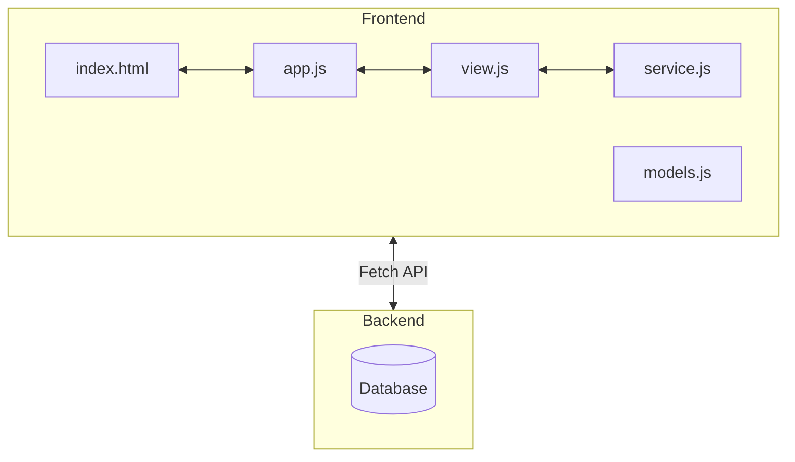

# JS-Frontend
v 1.0

## Themen
- [IIFE](https://developer.mozilla.org/en-US/docs/Glossary/IIFE) und Revealing Module Pattern
- [Event-Handling mit addEventListener(...)](https://developer.mozilla.org/en-US/docs/Web/API/EventTarget/addEventListener)
- [JS-Module](https://developer.mozilla.org/en-US/docs/Web/JavaScript/Guide/Modules)
  - [Import](https://developer.mozilla.org/en-US/docs/Web/JavaScript/Reference/Statements/import?retiredLocale=de)
  - [Export](https://developer.mozilla.org/en-US/docs/Web/JavaScript/Reference/Statements/export)
- [JS-Klassen](https://developer.mozilla.org/en-US/docs/Learn/JavaScript/Objects/Classes_in_JavaScript)
- [Fecth-API mit async/await](https://developer.mozilla.org/en-US/docs/Web/API/Fetch_API)
- [FormData](https://developer.mozilla.org/en-US/docs/Web/API/FormData?retiredLocale=de),
- [JSON](https://developer.mozilla.org/en-US/docs/Learn/JavaScript/Objects/JSON), 
- [Template Literals](https://developer.mozilla.org/en-US/docs/Web/JavaScript/Reference/Template_literals), 
- [Promises](https://developer.mozilla.org/en-US/docs/Web/JavaScript/Reference/Global_Objects/Promise), etc.


## Anforderungen - Allgemein

- Strikte Trennung von HTML, CSS und JS
- Verwendung von fortgeschrittenem Event-Handling
- JS-Code vor Zugriffen kapseln (Module-Pattern, Klassen, JS-Module, ...)
- JS-Code in Module strukturieren (Service, main, ...)
- Keine Verwendung von var


## Anforderungen - Applikation

Die Architektur soll bewusst einfach gehalten werden und zumindest aus einem Start/Initialisierungs-Script (z.B. app.js) sowie einem Service-Script (service.js) bestehen. Alle JS-Model Klassen sollen in eine eigene JavaScript-Datei, z.B.: models.js.



**app.js:**
- Für die Initialisierung der Applikation soll das *Revealing Module Pattern* verwendet werden

**view.js** (Optional - kann auch in app.js integriert werden)
- Ist die Schnittstelle zwischen HTML und Service
- Initialisiert benötigte HTML-Elemente im HTML-Doc mit Werten und verwaltet sie
- Registriert notwendige Events
- Befüllt die HTML-Elemente mit Daten und aktualisiert sie
- Greift auf das Service zu für CRUD-Operationen
- Optional: MVC-Muster
- Optional: View als JS-Klasse implementieren
- Optional: HTML-Template verwenden
- Optional: Eigene Web-Components z.B. für Table implementieren

**model.js:**
- Soll als JS-Modul implementiert werden
- Alle verwendeten Models sollen als JS-Klassen implementiert werden
- Die JSON-Daten vom Service sollen in Model-Klassen transferiert werden

**service.js**
- Soll als JS-Modul implementiert
- Alle Hilfs-Functions sollen _private_ sein (kein export)
- Beinhaltet die CRUD-Operationen und dient als Schnittstelle zum REST-API (Backend)
  - C - (Create) Erfassen von Daten mittels Form und POST an ein REST-API
  - R - (Read) Aufruf einer REST-API mit `fetch´ und anzeigen der Daten in einer Tabelle aus einem REST-API
  - U - (Update) Ändern eines bestehenden Datensatzes aus einem REST-API
  - D - (Delete) Löschen eines Datensatzes aus einem REST-API
- Alle Backend Aufrufe sollen mit der [Fetch-API](https://developer.mozilla.org/en-US/docs/Web/API/Fetch_API/Using_Fetch) durchgeführt werden


## REST API Beschreibung

Die REST-API ist eine Java Spring-Boot Applikation mit einer H2 In-Memory-DB. Sie kann entweder über den Befehl  
```shell
$ java -jar slm-rest-api-1.0.2.jar
```
oder über das Script `start-api.cmd` gestartet werden.
Beim ersten GET-Request werden, wenn noch keine Daten vorhanden sind, automatisch einige Test-Datensätze in der DB erzeugt.

 
| Methode | Pfad                                 | Beschreibung |
|---------|--------------------------------------| ---|
| GET     | http://localhost:8080/api/v1/model   | Liefert alle Model-Objekte zurück (ohne paging)
| GET     | http://localhost:8080/api/v1/model/3 | Liefert das Model-Objekt mit der Id 3 zurück
| POST    | http://localhost:8080/api/v1/model                         | Speichert das gesendete Model-Objekt in der DB
| PUT     | http://localhost:8080/api/v1/model/3                       | Führt ein Update des Model-Objekts mit der Id 3 durch
| DELETE  | http://localhost:8080/api/v1/model/3                       | Löscht das Model-Objekt mit der Id 3


JSON Response Beispiel:
```json
[
  {
    "id": 9,
    "hop": "Chelan",
    "malt": "Munich",
    "name": "Bourbon County Stout",
    "style": "Merican Ale"
  },
  {
    "id": 10,
    "hop": "Eroica",
    "malt": "Chocolate",
    "name": "Sierra Nevada Celebration Ale",
    "style": "Scottish And Irish Ale"
  }
]
```


## Überblick

| Datum    | Thema                     | Präsentation    |
|----------|---------------------------|-----------------|
| 22.05.   | Unterricht/Projektarbeit  |                 |
| 29.05.   | Unterricht/Projektarbeit  |                 |
| 05.06.   | Projektarbeit             |                 |
| 12.06.   | **T.:** **Projektabgabe** | Präsentation I  |
| 19.06.   |                           | Präsentation II |
| 26.06.   | Semesterende              |                 |


## Abgabe

- Benennen Sie Ihren Projektordner um: **4BAIF_JS-Frontend_ZUNAME_Vorname**
- Komprimieren (zip, rar, ...) Sie Ihr Projekt: **4BAIF_JS-Frontend_ZUNAME_Vorname.zip**
- Laden Sie Ihr Projekt auf Moodle hoch - Link: **_[Das Abgabefenster ist noch nicht geöffnet]_**


## Endpoints

| #   | Endpoint                               |
|-----|----------------------------------------|
| 1   | http://localhost:8080/api/v1/addresses |
| 2   | http://localhost:8080/api/v1/animals   |
| 3   | http://localhost:8080/api/v1/courses   |
| 4   | http://localhost:8080/api/v1/books     | 
| 5   | http://localhost:8080/api/v1/companies |
| 6   | http://localhost:8080/api/v1/heros     |
| 7   | http://localhost:8080/api/v1/persons   |
| 8   | http://localhost:8080/api/v1/products  |
| 9   | http://localhost:8080/api/v1/esports   |
| 10  | http://localhost:8080/api/v1/dogs      |
| 11  | http://localhost:8080/api/v1/files     |
| 12  | http://localhost:8080/api/v1/startrek  |
| 13  | http://localhost:8080/api/v1/cats      |
| 14  | http://localhost:8080/api/v1/jobs      |
| 15  | http://localhost:8080/api/v1/students  |
| 16  | http://localhost:8080/api/v1/patients  |
| 17  | http://localhost:8080/api/v1/hospitals |
| 18  | http://localhost:8080/api/v1/beers     |